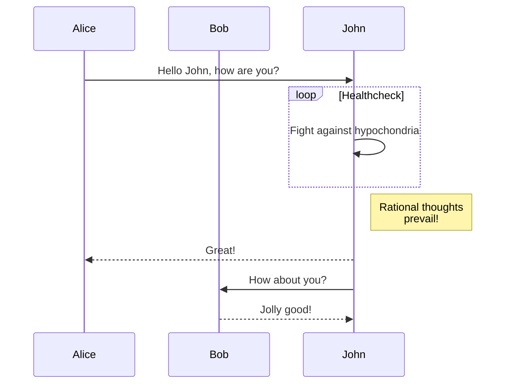
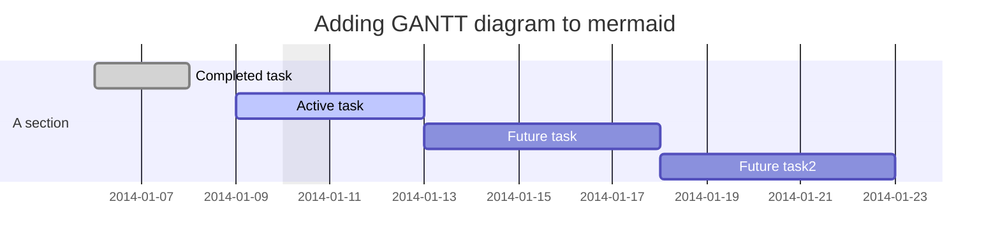
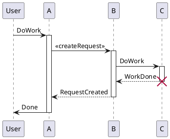
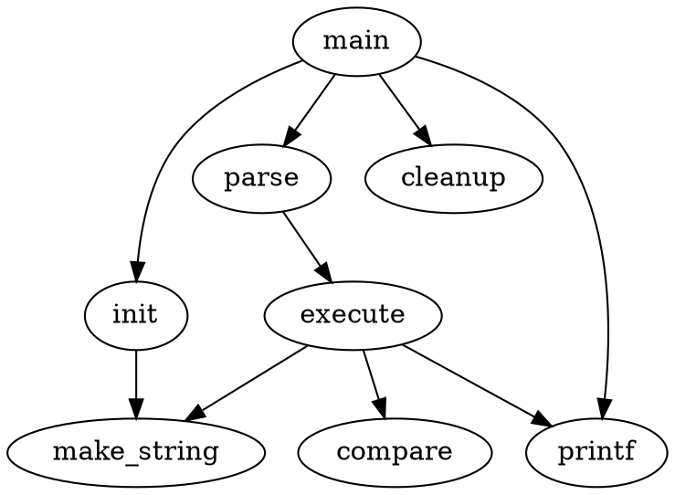

# Showdowns Demos

A lib that make markdown to html with some extensions of showdown.js.

## Markdown To Html

It can converte markdown content to html that using the [Showdown](https://github.com/showdownjs/showdown).

[Showdown](https://github.com/showdownjs/showdown) is a Javascript Markdown to HTML converter, based on the original works by John Gruber. Showdown can be used client side (in the browser) or server side (with NodeJs). For more information, refer to the following document:

- [Showdown's Markdown syntax](https://github.com/showdownjs/showdown/wiki/Showdown's-Markdown-syntax)
- [Showdown Options](https://github.com/showdownjs/showdown/wiki/Showdown-options)

## Table

| Return Code | Style | Value | DESC      |
| ----------- | ----- | ----- | --------- |
| OK          | int   | 1     | Succeeded |
| ERROR       | int   | 0     | Failed    |

## Supporting some markdown extension features

[TOC]

### LaTeX math and AsciiMath

It's supported by [showdown-katex](https://github.com/obedm503/showdown-katex.git), that render [LaTeX](https://www.latex-project.org/) math and [AsciiMath](http://asciimath.org/) using [KaTeX](https://github.com/Khan/KaTeX), You can check [KaTeX supported functions/symbols](https://khan.github.io/KaTeX/function-support.html).

#### Math examples

```asciimath
x = (-b +- sqrt(b^2-4ac)) / (2a)
```

```latex
x=\frac{ -b\pm\sqrt{ b^2-4ac } } {2a}
```

### Table of Contents

It's implemented sub-TOC in showdown-toc.js.

```
  [TOC]
```

[TOC]

#### sub-TOC examples1

#### sub-TOC examples2

### Mermaid

It's implemented in showdown-mermaid.js, render diagrams of Flowchart or Sequence or Gantt using [mermaid](https://github.com/knsv/mermaid), check [mermaid doc](https://mermaidjs.github.io) for more information.

#### Mermaid examples

##### Flowchart


##### Sequence diagram



##### Gantt diagram



### Plantuml

It's implemented in showdown-plantuml.js. render diagrams of uml using [plantuml](http://plantuml.com). To know more about PlantUML, please visit [plantuml website](http://plantuml.com/).

#### Plantuml examples



### Flowchart

```flow
st=>start: Start:>http://www.google.com[blank]
e=>end:>http://www.google.com
op1=>operation: My Operation
sub1=>subroutine: My Subroutine
cond=>condition: Yes
or No?:>http://www.google.com
io=>inputoutput: catch something...
para=>parallel: parallel tasks

st->op1->cond
cond(yes)->io->e
cond(no)->para
para(path1, bottom)->sub1(right)->op1
para(path2, top)->op1
```

```flowchart
st=>start: Start
e=>end
op1=>operation: My Operation
sub1=>subroutine: My Subroutine
cond=>condition: Yes
or No?:>http://www.google.com
io=>inputoutput: catch something
st->op1->cond
cond(yes)->io->e
cond(no)->sub1(right)->op1
```

### Network Sequence

```sequence {"theme":"hand"}
Alice->Bob: Hello Bob, how are you?
Note right of Bob: Bob thinks
Bob-->Alice: I am good thanks!
```

```sequence {"theme":"simple"}
Alice->Bob: Hello Bob, how are you?
Note right of Bob: Bob thinks
Bob-->Alice: I am good thanks!
```

### Graphviz's dot




### Railroad diagrams

```railroad
Diagram(
  Optional('+', 'skip'),
    Choice(0,
      NonTerminal('name-start char'),
      NonTerminal('escape')),
      ZeroOrMore(
        Choice(0,
          NonTerminal('name char'),
          NonTerminal('escape'))))
```

### WaveDrom

```wavedrom
{signal: [
  {name: 'clk', wave: 'p.....|...'},
  {name: 'dat', wave: 'x.345x|=.x', data: ['head', 'body', 'tail', 'data']},
  {name: 'req', wave: '0.1..0|1.0'},
  {},
  {name: 'ack', wave: '1.....|01.'}
]}
```

### Footnotes

It's implemented in showdown-footnotes.js, use for reference the [showdown-footnotes](https://github.com/Kriegslustig/showdown-footnotes).

#### Footnotes examples

[^1]: The explanation.
