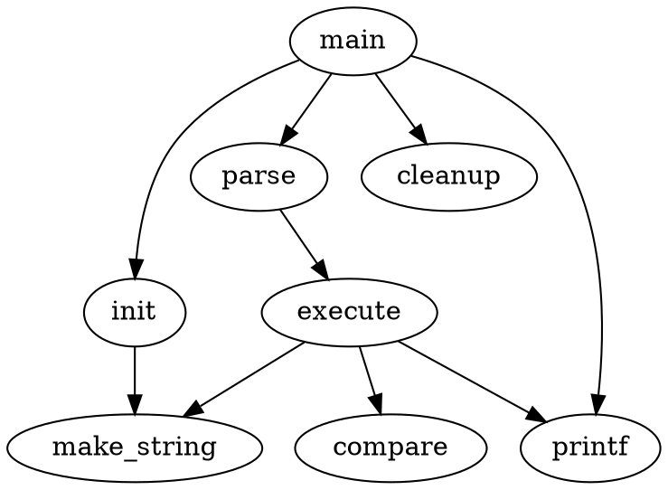

# [[TOC]]

# Graphviz's dot

It's implemented in showdown-viz.js, render diagrams of graphviz's dot using [viz.js](https://github.com/mdaines/viz.js).

## Markdown Syntax

The \<engine name> of json's "engine" field value is 'circo', 'dot', 'neato', 'osage', 'twopi' in syntax language attribute.

````
```dot {"engine": "<engine name>", "align": "<align>"}
<code content>
```
````

## Graphviz's dot example

* Dot example with dot engine:



<br>

* Dot example with circo engine:


