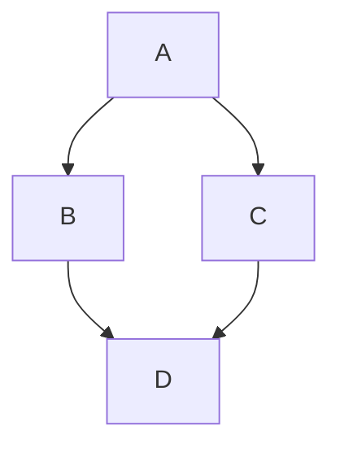
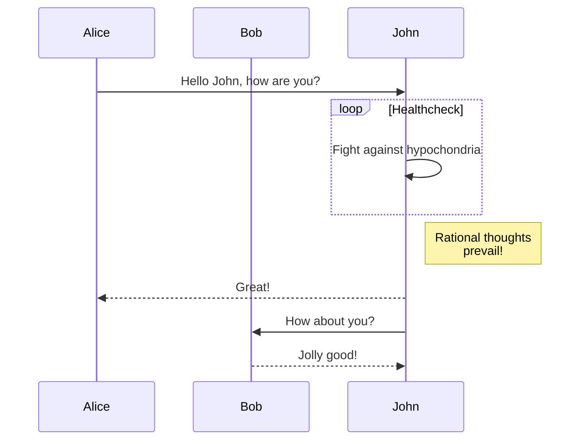
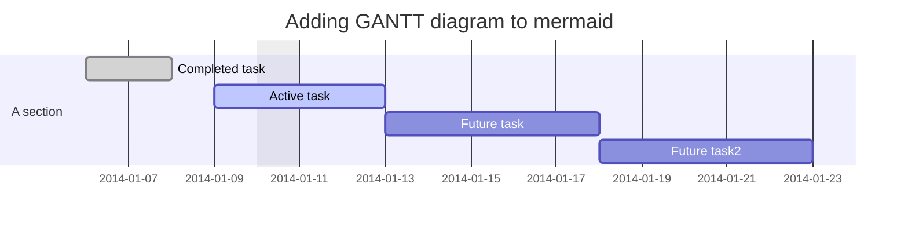
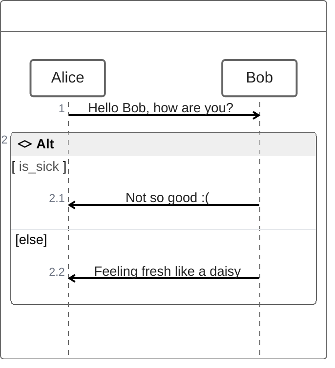
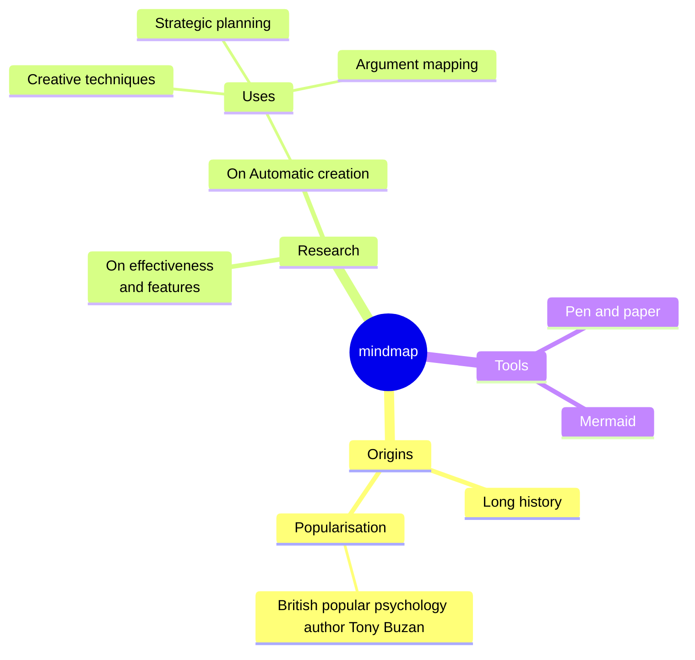

# [[TOC]]

# Mermaid

It's implemented in showdown-mermaid.js, render diagrams of Flowchart or Sequence or Gantt using [mermaid](https://github.com/knsv/mermaid), check [mermaid doc](https://mermaidjs.github.io) for more information.

## Markdown Syntax

* Flowchart syntax:

  ````
    ```mermaid {"align": "left | center | right", "codeblock": true | false}
    graph TD;
    <code content>
    ```
  ````

* Sequence diagram syntax:

  ````
    ```mermaid {"align": "left | center | right", "codeblock": true | false}
    sequenceDiagram
    <code content>
    ```
  ````

* Gantt diagram syntax:

  ````
    ```mermaid {"align": "left | center | right", "codeblock": true | false}
    gantt
    <code content>
    ```
  ````

* Support mermaid code of azure syntax

  ````
    :::mermaid 
      mermaid syntax content
    :::
  ````  

## Mermaid examples

### Flowchart




### Sequence diagram



### Gantt diagram



### ZenUML



### Mindmap


