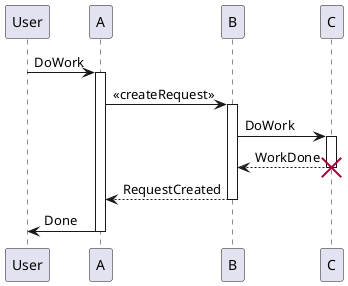

# [[TOC]]

# Plantuml

It's implemented in showdown-plantuml.js. render diagrams of uml using [plantuml](http://plantuml.com). To know more about PlantUML, please visit [plantuml website](http://plantuml.com/).

## Markdown Syntax

````
```plantuml {"align": "left | center | right", "codeblock": true | false}
@startuml
<code content>
@enduml
```
````

## Plantuml example


