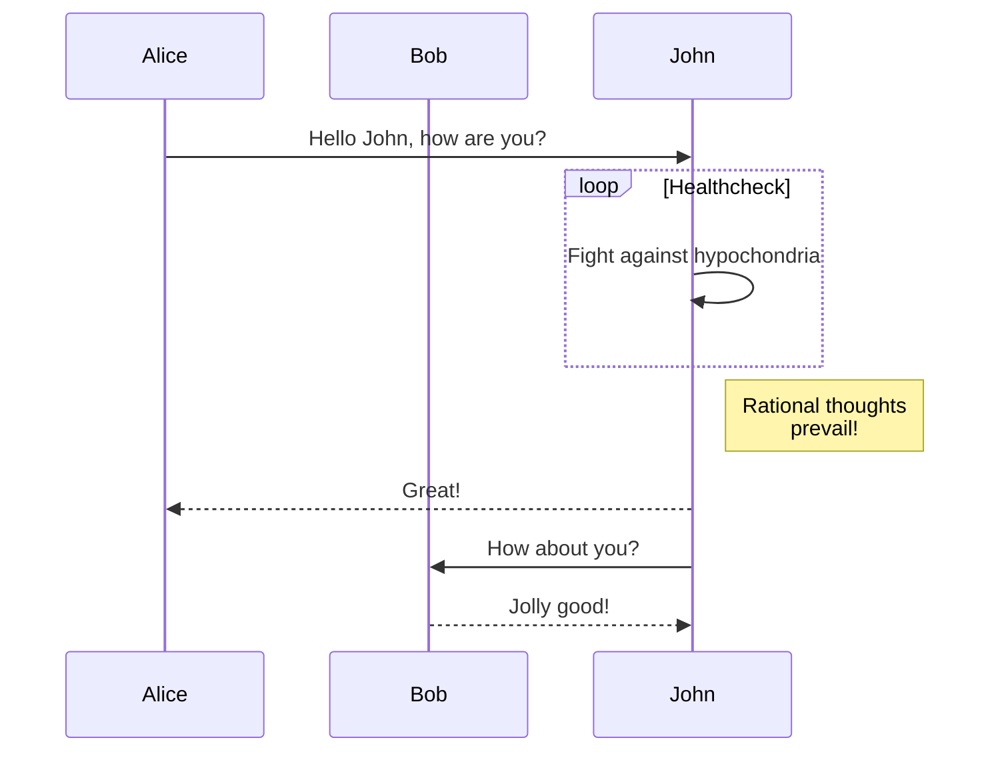
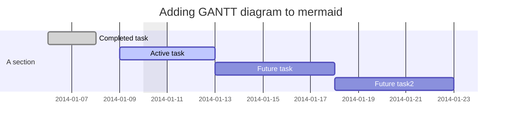
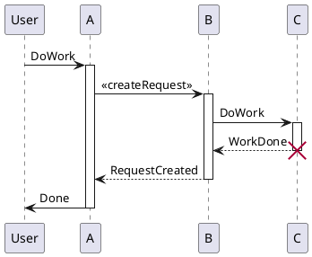

# Showdowns Demos

A lib that make markdown to html with some extensions of showdown.js.

## Markdown To Html

It can converte markdown content to html that using the [Showdown](https://github.com/showdownjs/showdown).

[Showdown](https://github.com/showdownjs/showdown) is a Javascript Markdown to HTML converter, based on the original works by John Gruber. Showdown can be used client side (in the browser) or server side (with NodeJs). For more information, refer to the following document:

- [Showdown's Markdown syntax](https://github.com/showdownjs/showdown/wiki/Showdown's-Markdown-syntax)
- [Showdown Options](https://github.com/showdownjs/showdown/wiki/Showdown-options)


## Table

| 返回码                        | 类型 | 值  | 描述                                          |
| ----------------------------- | ---- | --- | --------------------------------------------- |
| FGAMESDK_OK                   | int  | 1   | 调用函数调用返回成功或注册/检测等逻辑结果为真 |
| FGAMESDK_ERROR                | int  | 0   | 注册/检测等逻辑结果为假                       |
| FGAMESDK_ERROR_NOTCONNECT     | int  | -1  | 不能连接 First Game 平台                      |
| FGAMESDK_ERROR_CONNECTTIMEOUT | int  | -2  | 连接 First Game 平台时被超时                  |
| FGAMESDK_ERROR_AUTODISCONNECT | int  | -3  | 连接 First Game 平台时被自动断开              |
| FGAMESDK_ERROR_NOTREQUEST     | int  | -4  | 不能发送请求                                  |
| FGAMESDK_ERROR_REQUESTTIMEOUT | int  | -5  | 请求时被超时                                  |
| FGAMESDK_ERROR_NOREGIESTED    | int  | -6  | 未注册                                        |
| FGAMESDK_ERROR_INVAILDPARAMS  | int  | -7  | 无效参数                                      |
| FGAMESDK_ERROR_OUTOFMEMROY    | int  | -8  | 内存分配失败或内存不足                        |

## Supporting some markdown extension features

[TOC]

### LaTeX math and AsciiMath

It's supported by [showdown-katex](https://github.com/obedm503/showdown-katex.git), that render [LaTeX](https://www.latex-project.org/) math and [AsciiMath](http://asciimath.org/) using [KaTeX](https://github.com/Khan/KaTeX), You can check [KaTeX supported functions/symbols](https://khan.github.io/KaTeX/function-support.html).

#### Math examples

```asciimath
x = (-b +- sqrt(b^2-4ac)) / (2a)
```

```latex
x=\frac{ -b\pm\sqrt{ b^2-4ac } } {2a}
```

### Table of Contents

It's implemented sub-TOC in showdown-toc.js.

[TOC]

#### TOC examples

```
  [TOC]
```

### Mermaid

It's implemented in showdown-mermaid.js, render diagrams of Flowchart or Sequence or Gantt using [mermaid](https://github.com/knsv/mermaid), check [mermaid doc](https://mermaidjs.github.io) for more information.

#### Mermaid examples

##### Flowchart


##### Sequence diagram



##### Gantt diagram



### Plantuml

It's implemented in showdown-plantuml.js. render diagrams of uml using [plantuml](http://plantuml.com). To know more about PlantUML, please visit [plantuml website](http://plantuml.com/).

#### Plantuml examples



### Footnotes

It's implemented in showdown-footnotes.js, use for reference the [showdown-footnotes](https://github.com/Kriegslustig/showdown-footnotes).

#### Footnotes examples

[^1]: The explanation.

